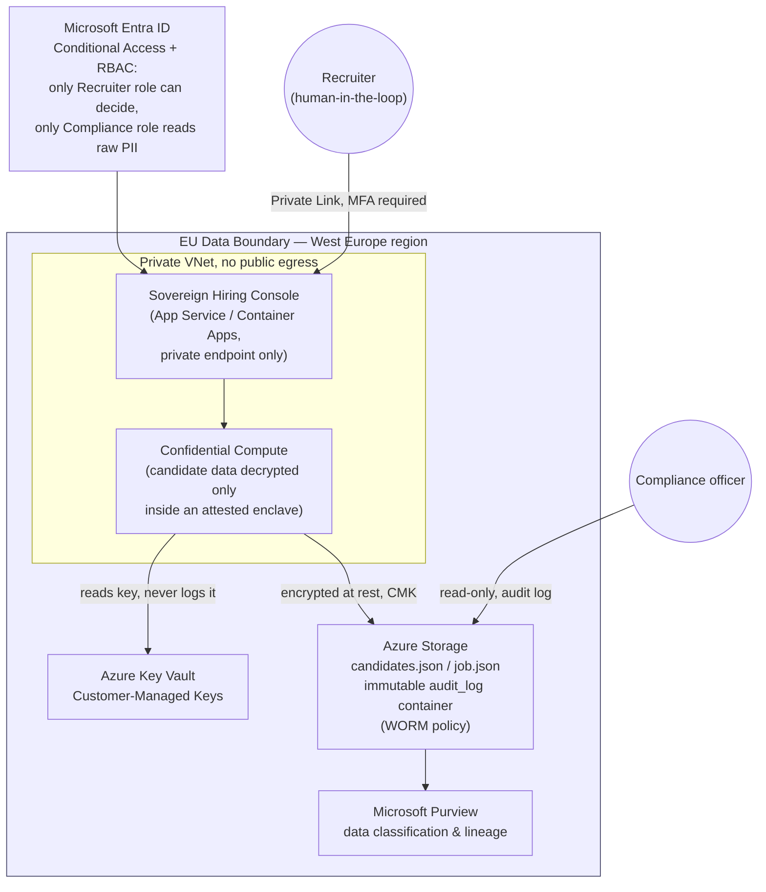

# Target architecture: sovereign production deployment

This repo's demo runs entirely on one machine with flat JSON files and zero network
calls, so it can be judged without any cloud account. This document describes the
**production target** it is a proof-of-concept for: the sovereign Azure environment an
organisation would actually deploy the Sovereign Hiring Console into. No resources
described here are provisioned by this repo — this is a design deliverable, not a live
system (there is no Azure subscription available in this build environment).

## Diagram

## Mapping design choices to sovereignty and regulatory requirements

| Concern | Design choice | Regulation |
|---|---|---|
| Where does the data live? | EU region (West Europe) only, inside the Microsoft EU Data Boundary; storage account and compute pinned to that region | GDPR Ch. V (cross-border transfer restrictions) |
| Who can access raw PII? | Entra ID RBAC — only a "Compliance" role can view unredacted candidate records; recruiters only ever see the redacted view this demo implements | GDPR Art. 5, 32 (security of processing) |
| Is processing confidential? | Azure Confidential Computing: candidate data is decrypted only inside an attested TEE, never visible to the underlying host/hypervisor operator | GDPR Art. 32; sector confidentiality rules |
| Can encryption keys be revoked/controlled by the customer? | Customer-Managed Keys in Azure Key Vault, not Microsoft-managed keys | Data sovereignty / "right to be forgotten" key-shredding pattern |
| Is there a tamper-evident record of every decision? | Audit log written to immutable (WORM) Azure Storage, readable by Compliance but not editable by anyone | EU AI Act Art. 12 (record-keeping for high-risk AI) |
| Is a human always in control of high-risk decisions? | Application layer enforces `decision_status` starts `pending` and requires an authenticated recruiter action; nothing here is a design bypass — it is the same rule the local demo enforces in `app/server.py` | EU AI Act Annex III + Art. 14 (human oversight, high-risk employment AI); GDPR Art. 22 |
| Is the AI decision explainable? | The scoring engine (`app/scoring.py`) is a deterministic, template-explained rubric, not an opaque model — the same code would run inside the Confidential Compute boundary above, so "explainable" and "sovereign" are the same design choice, not a trade-off | EU AI Act Art. 13 (transparency) |
| What is governed/classified? | Microsoft Purview scans the storage account so both the raw and redacted datasets are labeled and their lineage tracked | Internal governance; supports GDPR Art. 30 records of processing |

## What the demo proves today vs. what the target adds

The working demo already proves the two hardest-to-fake claims — "sensitive data never
leaves the machine" (no outbound calls in `app/server.py`, verifiable by inspecting the
code and by running it offline) and "a human is always the one who decides" (`/api/decide`
in `app/server.py` is the only path that changes a candidate's status, and it requires a
named human actor). The Azure layer above adds defense-in-depth (encryption, network
isolation, tamper-evident storage, formal RBAC) around that same logic for a multi-tenant
production deployment — it does not change the sovereignty guarantees, it hardens them.
